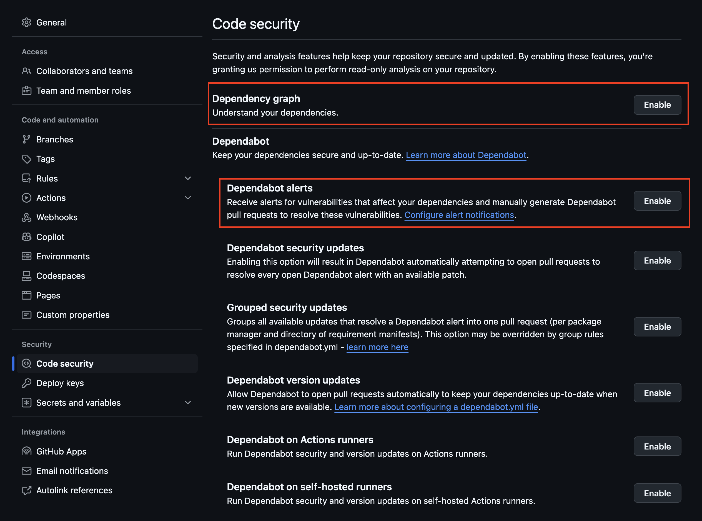
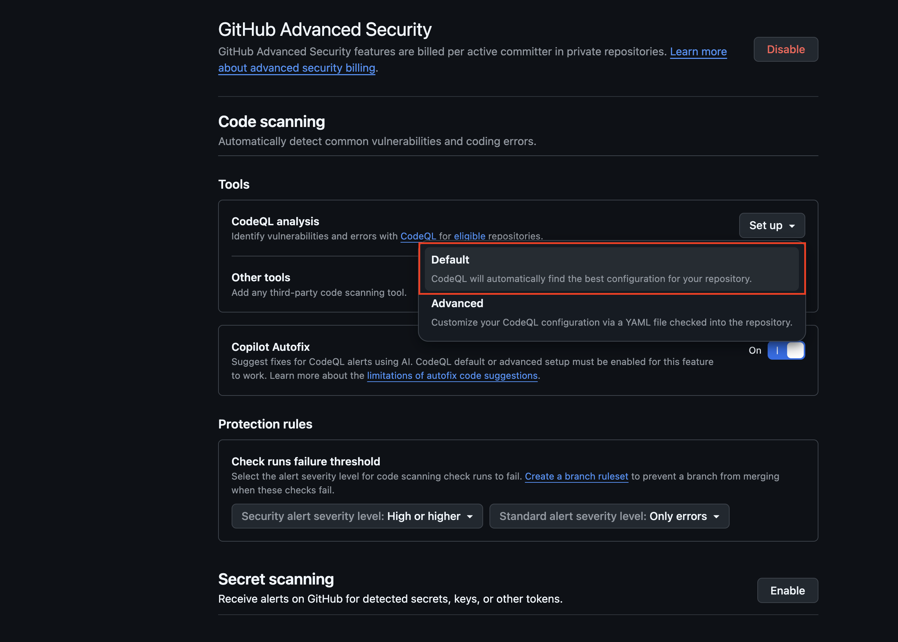
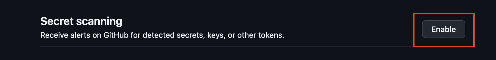

# Understand how to configure GitHub Advanced Security for a repository

Let's access your own repository in your space and configure Dependabot, Code Scanning and Secret Scanning.

## Task 1: Enable Dependabot 
To enable Dependabot, go to the Repository Settings and navigate to the Code Security section. Make sure to click on `Enable` under both `Dependency graph` and `Dependabot alerts`.



From now on, the Dependency Graph will allow you to visually inspect the dependencies of your repository, and any vulnerabilities affecting those will be raised as an alert. 

### Add a Pull Request Dependency Review Action
Raising alerts on dependencies that are already in production is good, but detecting those before shipping them is even better. We will configure the `Dependency Review Action` to detect vulnerabilities affecting dependencies being added within Pull Requests. This will allow us to shift left, and eventually, block those PRs later on during this workshop.

Add a YAML workflow file named `dependency-review.yaml` to your `.github/workflows` folder, with the following content:

```yaml
name: 'Dependency Review'
on: [pull_request]

permissions:
  contents: read

jobs:
  dependency-review:
    runs-on: ubuntu-latest
    steps:
    - name: 'Checkout Repository'
      uses: actions/checkout@v4
    - name: Dependency Review
      uses: actions/dependency-review-action@v4
      with:
        # Possible values: "critical", "high", "moderate", "low"
        fail-on-severity: critical
```

Full file can be found here: [dependency-review.yaml](./resources/dependency-review.yaml)

## Task 2: Enable Code Scanning 
Under the Code scanning section, click on the `Set up` dropdown and select `Default`. 



This will set up `CodeQL`, which is GitHub's Code Scanning tool, using a default configuration for your repository. This default configuration will make sure to scan your repository's code as follows:

- On each push to the repository's default branch, or any protected branch. For more information on protected branches, see "About protected branches."
- When creating or committing to a pull request based against the repository's default branch, or any protected branch, excluding pull requests from forks.
- On a weekly schedule.

## Task 3: Enable Secret Scanning
To enable Secret Scanning, simply click the `Enable` button and you're good to go! (for OOS projects this is enabled by default)



## Outcomes achieved in this exercise
**1. Enabled Dependabot**

**2. Added security measures on the pull request**
- Created a workflow including the `Dependency review` action

**3. Enabled Code Scanning**
- Default setup

**4. Enabled Secret Scanning**