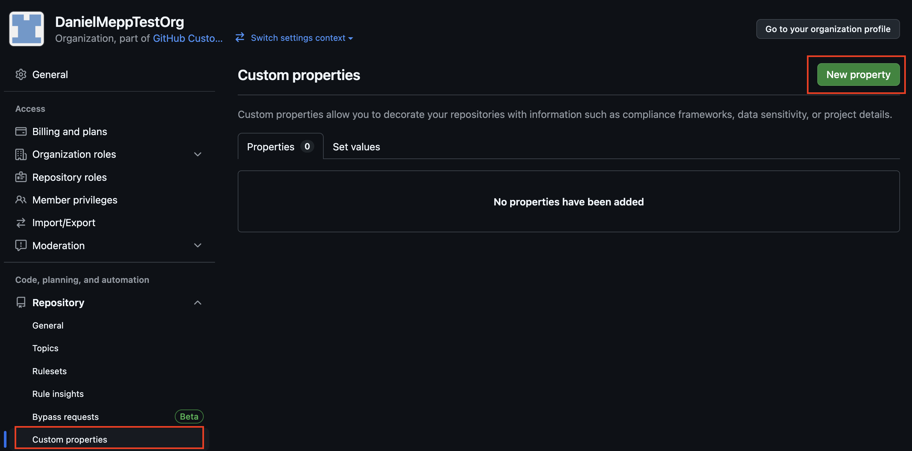
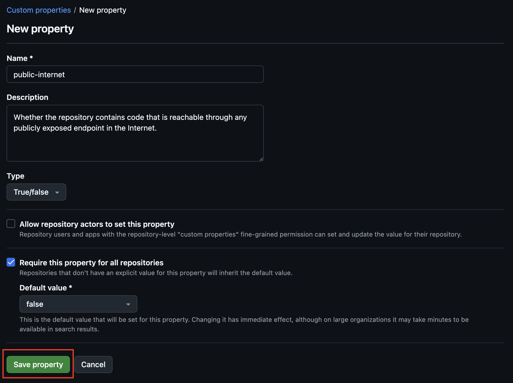
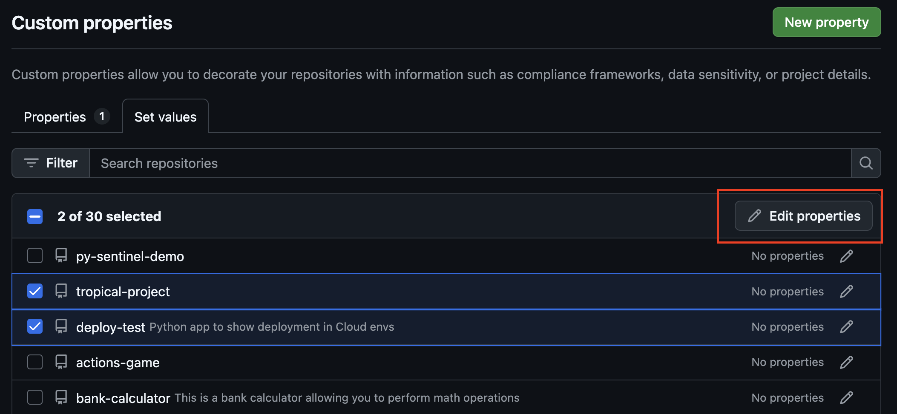
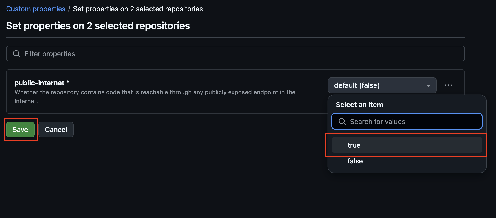
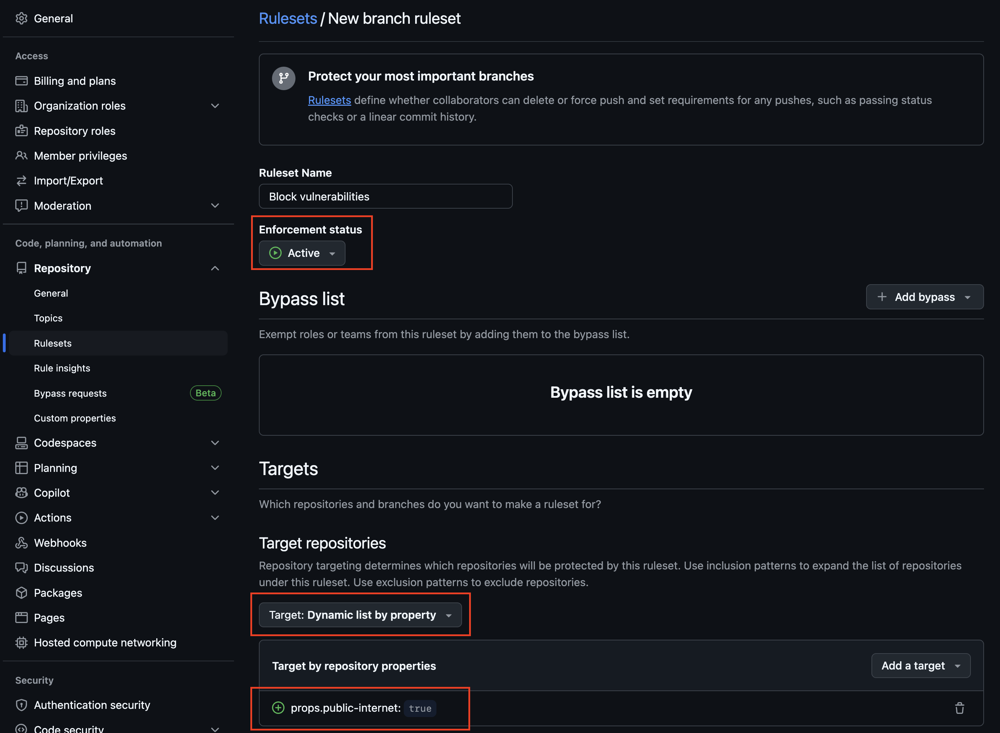
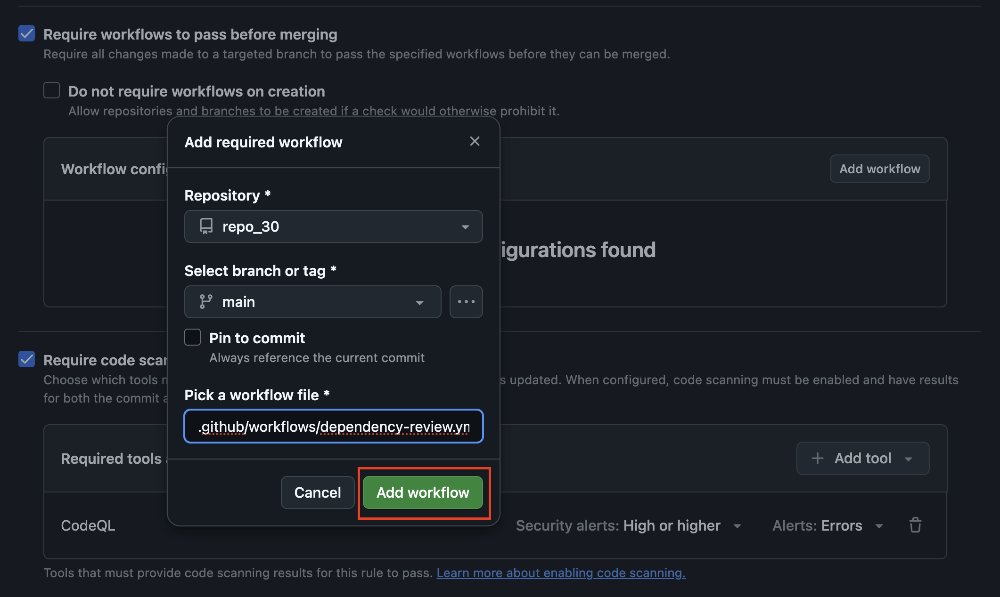

# Discover how to scale GitHub Advanced Security setup and policies for repositories

## Task 1: Create and set custom repository properties

Not all of your repositories may require the same set of code security configurations. Let's imagine you have a group of repositories that contain the code for business-critical production web applications that are exposed to the public Internet. You may want to apply a different configuration to them. Let's first label them with custom Repository Properties.

Under `Custom properties` on the Organization's settings left sidebar, click on `New property`. 

Fill in the form as follows and click on `Save property` once you are ready. Note that we are creating a `boolean` property and enforcing it to be set for all repositories with a default value set to `false`.

Now let's choose a couple of repositories and navigate to edit their properties' values.

Now set the `public-internet` custom property to `True` and click on `Save`. 

## Task 2: Block PRs introducing vulnerabilities

With all the Organization repositories now raising alerts on dependencies, code vulnerabilities and leaked secrets, we can now go a step beyond and block new security vulnerabilities from being merged in production. That's proper shift-left security!

> **Note:** Remember that Secrets are already being blocked on push thanks to Push Protection, which is configured on your Security Configurations. 

Let's create a new Organization Ruleset that will block Pull Requests that introduce new vulnerabilities, whether they're coming from the code you wrote or newly introduced dependencies. 

Navigate to the `Rulesets` settings of your Organization and click on `New ruleset`, then `New branch ruleset`. 

Give it a name of your choice, such as `Block PRs with new vulnerabilities`. Set the enforcement status to `Active`, and target repositories by `Dynamic list property`. We will target repositories that have the `public-internet` property set to `true`, simply to illustrate how rulesets can be enforced granularly. 

We want to make sure to target only the default branch of the repositories, so click on `Add target` and select `Default branch`.

Let's set up the rules that this Ruleset will apply:

- We will require pull requests before merging into the Default branch. Simply click the checkbox `Require pull request before merging` and you are done!
- We will require that the `CodeQL` tool provides satisfactory code scanning results. Check the checkbox `Require code scanning results` and set the `Code scanning tool` to `CodeQL` and the `Security alerts` threshold to `High or higher`.

- We will require that the `Dependency review` workflow passes. Check the checkbox `Require workflows to pass before merging` and add the workflow `dependency-review.yml` that you created in the first exercise of this workshop.

Click on `Create` and your new Organizational Ruleset will make sure that no new vulnerabilities are introduced in the default branches of your most critical repositories!

## Outcomes achieved in this exercise

**1. Repository custom properties**
- Created and applied to classify a repository and/or a group of repositories

**2. Organization ruleset**
- Created and applied an organization ruleset to enforce checks standards to a classified set of repositories through repository custom properties